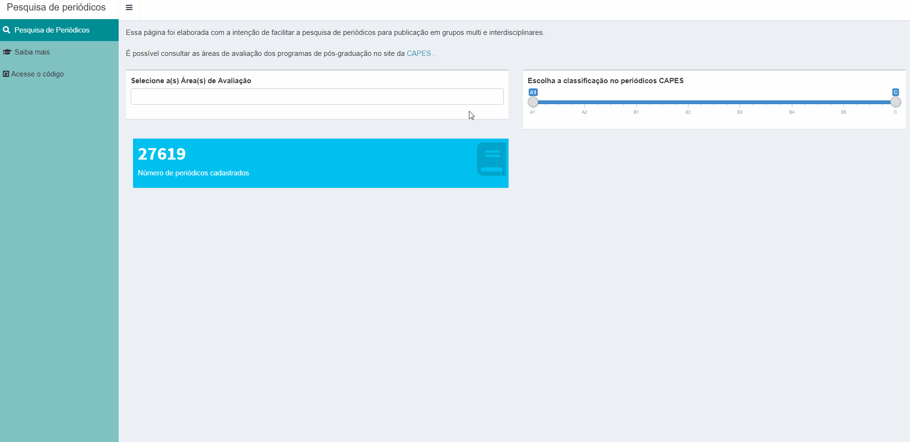
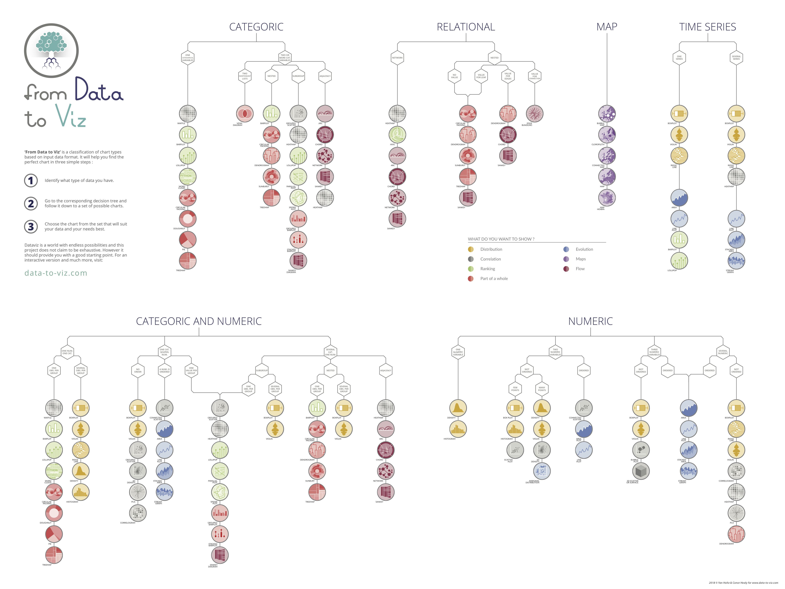

layout: true
  
<div class="my-footer"><span>

<a href="https://twitter.com/RLadiesSaoPaulo">Twitter</a> | 
<a href="http://instagram.com/RLadiesSaoPaulo">Instagram</a> |
<a href="http://facebook.com/RLadiesSaoPaulo">Facebook</a> |
<a href="https://www.meetup.com/pt-BR/R-Ladies-Sao-Paulo">Meetup</a> |
<a href="https://github.com/rladies/meetup-presentations_sao-paulo">Github</a> |
<a href="http://bit.ly/xxxx">bit.ly/xxx</a> 


</span></div> 

---
class: middle

```{r setup, include=FALSE}
knitr::opts_chunk$set(echo = FALSE, fig.align = "center", message=FALSE, warning=FALSE, out.width = "60%")
```

# Programação

- 
- 
-

---
class:  center

```{r, out.width="15%", fig.cap="<center><b>Logo - R-Ladies </center></b>"}
knitr::include_graphics("img/hexlogorladies.jpeg")
```

- R-Ladies é uma organização mundial que **promove a diversidade de gênero** na comunidade da linguagem R.

- R-Ladies São Paulo integra, orgulhosamente, a organização R-Ladies Global, em São Paulo. 

--

- [Código de conduta - R-Ladies](https://github.com/rladies/starter-kit/wiki/Code-of-Conduct#portuguese)

--

- Saiba mais:
  - Website RLadies Global: [https://rladies.org/](https://rladies.org/)
  - Twitter: [@RLadiesGlobal](https://twitter.com/rladiesglobal), [@RLadiesSaoPaulo](https://twitter.com/RLadiesSaoPaulo)
  - Instagram: [@RLadiesSaoPaulo](http://instagram.com/RLadiesSaoPaulo)
  - Facebook: [@RLadiesSaoPaulo](http://facebook.com/RLadiesSaoPaulo)
  - MeetUp: [https://www.meetup.com/pt-BR/R-Ladies-Sao-Paulo](https://www.meetup.com/pt-BR/R-Ladies-Sao-Paulo)
  - Github: [https://github.com/rladies/meetup-presentations_sao-paulo](https://github.com/rladies/meetup-presentations_sao-paulo)


---
class: middle

# O que é R?

- É uma linguagem de programação

- É também um software gratuito

- Saiba mais em: [r-project.org](https://www.r-project.org/about.html) 

```{r, out.width="30%", fig.cap="<center><b>Logo - R </center></b>"}
knitr::include_graphics("img/R_logo.svg.png")
```
---
class: middle

# Pacotes

- "Um pacote R é uma coleção de funções, dados e documentação que amplia os recursos do R base" ([WICKHAM & GROLEMUND, 2017](https://r4ds.had.co.nz/))

  - [**CRAN** - The Comprehensive R Archive Network](https://cran.r-project.org/web/packages/)
     + Mais de 14.600 pacotes disponíveis  
     
  - [**Bioconductor** - Open Source Software for Bioinformatics](https://www.bioconductor.org/)
     + Mais de 1.700 pacotes disponíveis 
     
  - [**Github**](https://github.com/)
     + Quantidade desconhecida!


---
class: middle
# Tidyverse 

- Os pacotes do [tidyverse](https://www.tidyverse.org/) compartilham uma filosofia comum de dados e programação R, e são projetados para trabalhar juntos naturalmente ([WICKHAM & GROLEMUND, 2017](https://r4ds.had.co.nz/))

```{r, out.width="70%", fig.cap="<center><b>Ilustração por Allison Horst - Twitter: <a href='https://twitter.com/allison_horst/'> @allison_horst</a> </b></center>"}
knitr::include_graphics("img/allisonhorst/tidyverse.jpg")
```

---
class: middle

# O ciclo da ciência de dados
```{r, out.width="70%", fig.cap="<center><b>Ilustração por Allison Horst - Twitter: <a href='https://twitter.com/allison_horst/'> @allison_horst</a> - Adaptado de WICKHAM & GROLEMUND, 2017</b></center>"}
knitr::include_graphics("img/allisonhorst/data-analysis.jpg")
```

---
class: middle

# Parte dos slides da Nath 
---
class: middle

# **Quais são os principais pacotes para visualização de dados?**

---
class: middle

# Pacote ggplot2

```{r, out.width="50%", fig.cap="<center><b>Ilustração por Allison Horst - Twitter: <a href='https://twitter.com/allison_horst/'> @allison_horst</a> </b></center>"}
knitr::include_graphics("img/allisonhorst/ggplot2_obra_prima_pt.png")
```
---
class: middle

# Pacote ggplot2

```{r, out.width="20%", fig.cap="<center><b>Logo: <a href='https://rmarkdown.rstudio.com'>Pacote ggplot2</a></b></center>"}
knitr::include_graphics("img/rlogos/hex-ggplot2.png")
```

- Mantido pela [RStudio](https://rstudio.com/)

- Criado pelo [Hadley Wickham](http://hadley.nz/)

- Possibilita a criação de diversos tipos de gráficos


---
class: middle

# Exemplos ggplot2 

```{r}
library(ggplot2)
library(gganimate)
library(gapminder)
theme_set(theme_bw())
```

```{r message=FALSE, warning=FALSE, out.width="40%", cache = TRUE, fig.cap="<center><b>Fonte: <a href='https://www.datanovia.com/en/blog/gganimate-how-to-create-plots-with-beautiful-animation-in-r/'>Adaptado de Data Novia</a></b></center>"}
p <- ggplot(
  gapminder, 
  aes(x = gdpPercap, y=lifeExp, size = pop, colour = country)
  ) +
  geom_point(show.legend = FALSE, alpha = 0.7) +
  scale_color_viridis_d() +
  scale_size(range = c(2, 12)) +
  scale_x_log10() +
  labs(x = "PIB per capita", y = "Expectativa de vida (anos)")
p
```


---
class: middle

# Exemplos ggplot2 + gganimate
```{r, cache = TRUE, fig.cap="<center><b>Fonte: <a href='https://www.datanovia.com/en/blog/gganimate-how-to-create-plots-with-beautiful-animation-in-r/'>Adaptado de Data Novia</a></b></center>", out.width="40%"}
p + transition_time(year) +
  labs(title = "Ano: {frame_time}")
```

---
class: middle

# Exemplos ggplot2 + gganimate
```{r, cache = TRUE,out.width="40%", fig.cap="<center><b>Fonte: <a href='https://www.datanovia.com/en/blog/gganimate-how-to-create-plots-with-beautiful-animation-in-r/'>Adaptado de Data Novia</a></b></center>"}
p + facet_wrap(~continent) +
  transition_time(year) +
  labs(title = "Ano: {frame_time}")
```
---
class: middle

### Highcharter

```{r, cache = TRUE, fig.cap="<center><b> Fonte: <a href='https://rkabacoff.github.io/datavis/Interactive.html'>Adaptado de Datavis with R </a></b></center>", out.width="25%", cache=TRUE}

# create interactive line chart
library(highcharter)

# prepare data
data(gapminder, package = "gapminder")
library(dplyr)
asia <- gapminder %>%
  filter(continent == "Americas") %>%
  select(year, country, lifeExp)

# convert to long to wide format
library(tidyr)
plotdata <- spread(asia, country, lifeExp)

# generate graph
h <- highchart() %>% 
  hc_xAxis(categories = plotdata$year) %>% 
  hc_add_series(name = "Brasil", 
                data = plotdata$Brazil) %>% 
  hc_add_series(name = "Argentina", 
                data = plotdata$Argentina) %>%
  hc_add_series(name = "Paraguai", 
                data = plotdata$Paraguay) %>%
  hc_add_series(name = "Uruguai", 
                data = plotdata$Uruguay) %>%

  hc_title(text = "Expectativa de vida por País - Mercosul",
           margin = 20, 
           align = "left",
           style = list(color = "steelblue")) %>% 
  hc_subtitle(text = "1952 à 2007",
              align = "left",
              style = list(color = "#2b908f", 
                           fontWeight = "bold")) %>% 
  hc_credits(enabled = TRUE, # add credits
             text = "Gapminder Data",
             href = "http://gapminder.com") %>% 
  hc_legend(align = "left", 
            verticalAlign = "top",
            layout = "vertical", 
            x = 0, 
            y = 100) %>%
  hc_tooltip(crosshairs = TRUE, 
             backgroundColor = "#FCFFC5",
             shared = TRUE, 
             borderWidth = 4) %>% 
  hc_exporting(enabled = TRUE)

  h
```

---
class: middle

# Pacote rmarkdown

```{r, out.width="50%", fig.cap="<center><b>Ilustração por Allison Horst - Twitter: <a href='https://twitter.com/allison_horst/'> @allison_horst</a> </b></center>"}
knitr::include_graphics("img/allisonhorst/rmarkdown_wizards.png")
```


---
class: middle

# Pacote rmarkdown

```{r, out.width="15%", fig.cap="<center><b>Logo: <a href='https://rmarkdown.rstudio.com'>Pacote rmarkdown</a></b></center>"}
knitr::include_graphics("img/rlogos/hex-rmarkdown.png")
```

- Mantido pela [RStudio](https://rstudio.com/)

- extensão `.Rmd`

- Possibilita a utilização de códigos R, Markdown, HTML e outros.

- Útil para relatórios dinâmicos!

- Confira a [Galeria](https://rmarkdown.rstudio.com/gallery.html)!


---
class: middle

# Pacote rmarkdown

```{r, out.width="40%", fig.cap="<center><b>Fonte: <a href='https://rmarkdown.rstudio.com'>Pacote rmarkdown</a></b></center>"}
knitr::include_graphics("img/RMarkdownOutputFormats.png")
```


---
class: middle

# Pacote xaringan

```{r, out.width="20%", fig.cap="<center><b>Logo: <a href='https://github.com/yihui/xaringan'>Pacote xaringan</a></b></center>"}
knitr::include_graphics("img/rlogos/hex-xaringan.png")
```

- Possibilita criar apresentações **ninja** com R Markdown

- Utiliza a biblioteca remark.js

- Resultado em HTML (mas também PDF - estático)

---
class: middle

# Pacote Shiny

```{r, out.width="20%", fig.cap="<center><b>Logo: <a href='https://shiny.rstudio.com/'>Pacote Shiny</a></b></center>"}

```

- Mantido pela [RStudio](https://rstudio.com/)

- Dashboards interativos

- Confira a [Galeria](https://shiny.rstudio.com/gallery/)!

---
class: middle

# Exemplo de Shiny

```{r, out.width="80%", fig.cap="<center><b>GIF: Demonstração de um  <a href='https://beatriz-milz.shinyapps.io/pesquisa_periodicos/'>Shiny de consulta de Periódicos</a> </b></center>"}


```

---
class: middle

# Exemplo de Shiny

```{r, out.width="80%", fig.cap="<center><b>GIF: Demonstração de um  <a href='https://apps.garrickadenbuie.com/user-2019/'>Shiny com Tweets sobre a useR!2019 Conf. </a> </b></center>"}

knitr::include_graphics("img/user2019shiny.gif")
```

---
class: middle

# Pacote leaflet

```{r, out.width="40%", fig.cap="<center><b>Logo: <a href='https://leafletjs.com/'>Biblioteca Leaflet</a></b></center>"}
knitr::include_graphics("img/logo-leaflet.svg")
```

- Mantido pela [RStudio](https://rstudio.com/)

- É uma biblioteca javascript para criação de mapas interativos. 

- O [pacote leaflet do R](https://rstudio.github.io/leaflet/) é um htmlwidget que permite gerar esses mapas de forma direta no R, para usar em documentos RMarkdown e Shiny.


Fonte: [Post no blog da Curso-R](https://www.curso-r.com/blog/2017-02-21-markercluster/)


---
class: middle

# Exemplo - leaflet + Shiny

```{r, out.width="80%", fig.cap="<center><b>GIF: Demonstração do  <a href='http://shiny.rstudio.com/gallery/superzip-example.html'>Shiny Super Zip Explorer</a> </b></center>"}

knitr::include_graphics("img/shinyleaflet.gif")
```

- Código disponível no [Github - RStudio](https://github.com/rstudio/shiny-examples/tree/master/063-superzip-example)


---
class: middle

# PARTE PRÁTICA

---
class: middle

```{r, out.width="75%", fig.cap="<center><b>Fonte: <a href='https://www.data-to-viz.com/'>From Data to Viz</a> </b></center>"}

```


---
class: middle

```{r, out.width="50%", fig.cap="<center><b>Ilustração por Allison Horst - Twitter: <a href='https://twitter.com/allison_horst/'> @allison_horst</a> </b></center>"}
knitr::include_graphics("img/allisonhorst/community1.jpg")
```
---
class: middle

# Rascunho Geovana
---
class: middle
# Histograma

.left-code[
```{r plot-exemplo-hist1, echo=TRUE, fig.show="hide", out.width="90%"}
library(ggplot2)
library(MASS)

df <- Cars93 #criando um dataframe

ggplot(df, aes(x = Horsepower)) 
```
]

.right-plot[
`)
]
---
class: middle
# Histograma

.left-code[
```{r plot-exemplo-hist2, echo=TRUE, fig.show="hide", out.width="90%"}
ggplot(df, aes(x = Horsepower)) +
  geom_histogram()
```
]

.right-plot[
`)
]
---
class: middle
# Histograma

.left-code[
```{r plot-exemplo-hist3, echo=TRUE, fig.show="hide", out.width="90%"}
ggplot(df, aes(x = Horsepower)) +
  geom_histogram(binwidth  = 5,
                 color = "black",
                 fill = "darkorchid4")
```
]

.right-plot[
`)
]
---
class: middle
# Histograma

.left-code[
```{r plot-exemplo-hist4, echo=TRUE, fig.show="hide", out.width="90%"}
ggplot(df, aes(x = Horsepower)) +
  geom_histogram(binwidth  = 5,
                 color = "black",
                 fill = "darkorchid4") +
  theme_bw() +
  labs(x = "Frequencia", 
       y = "Horsepower", 
       title = "Potencia")
```
]

.right-plot[
`)
]
---
class: middle
# Histograma

.left-code[
```{r plot-exemplo-hist5, echo=TRUE, fig.show="hide", out.width="90%"}
ggplot(df, aes(x = Horsepower)) +
  geom_histogram(bins = 10, 
                 color = "black", 
                 fill = "darkorchid4") +
  theme_bw() +
  labs(x = "Frequencia", 
       y = "Horsepower", 
       title = "Potencia")
```
]

.right-plot[
`)
]

---
class: middle
# Gráfico de Barras

.left-code[
```{r plot-exemplo-bar1, echo=TRUE, fig.show="hide", out.width="90%"}
b <- ggplot(df, aes(x = Type))
b
```
]

.right-plot[
`)
]

---
class: middle
# Gráfico de Barras

.left-code[
```{r plot-exemplo-bar2, echo=TRUE, fig.show="hide", out.width="90%"}
b + geom_bar()
```
]

.right-plot[
`)
]
---
class: middle
# Gráfico de Barras

.left-code[
```{r plot-exemplo-bar3, echo=TRUE, fig.show="hide", out.width="90%"}
b + geom_bar(fill = "darkorchid4")
```
]

.right-plot[
`)
]

---
class: middle
# Gráfico de Barras

.left-code[
```{r plot-exemplo-bar5, echo=TRUE, fig.show="hide", out.width="90%"}
b + geom_bar(fill = "darkorchid4") +
  labs(x = "Tipo de carro", y = "Contagem",
       title = "Tipo de carro") +
  theme_minimal()
```
]

.right-plot[
`)
]
---
class: middle
# Gráfico de Barras

.left-code[
```{r plot-exemplo-bar6, echo=TRUE, fig.show="hide", out.width="90%"}
b + geom_bar(fill = "darkorchid4") +
  labs(x = "Tipo de carro", y = "Contagem",
       title = "Tipo de carro") +
  theme_minimal() +
  facet_grid( ~ AirBags)
```
]

.right-plot[
`)
]
---
class: middle
# Gráfico de Barras

.left-code[
```{r plot-exemplo-bar7, echo=TRUE, fig.show="hide", out.width="90%"}
bar <- ggplot(df, aes(Type, fill = AirBags))

bar + geom_bar(position = "dodge", 
               color = "black") +
  scale_fill_brewer(palette = "Purples", 
                    direction = 1) +
  theme_minimal()
```
]

.right-plot[
`)
]
---
class: middle
# Gráfico de Barras

.left-code[
```{r plot-exemplo-bar8, echo=TRUE, fig.show="hide", out.width="90%"}
bar + geom_bar(position = "fill", 
               color = "black") +
  scale_fill_brewer(palette = "Purples", 
                    direction = 1) +
  theme_minimal()
```
]

.right-plot[
`)
]

---
class: middle
# Gráfico de Barras

.left-code[
```{r plot-exemplo-bar9, echo=TRUE, fig.show="hide", out.width="90%"}
bar + geom_bar(position = "stack", 
               color = "black") +
  scale_fill_brewer(palette = "Purples", 
                    direction = 1) +
  theme_minimal()
```
]

.right-plot[
`)
]
---
class: middle
# Gráfico de Barras

.left-code[
```{r plot-exemplo-bar10, echo=TRUE, fig.show="hide", out.width="90%"}
bar + geom_bar(position = "stack", 
               color = "black") +
  scale_fill_brewer(palette = "Purples", 
                    direction = 1) +
  theme_minimal() +
  coord_flip()
```
]

.right-plot[
`)
]
---
class: middle
# Boxplot

.left-code[
```{r plot-exemplo-bpt1, echo=TRUE, fig.show="hide", out.width="90%"}
dfhair <- data.frame(HairEyeColor)

ggplot(dfhair, aes(x = as.factor(Sex), y = Freq, 
                   fill = Sex)) +
  theme_minimal() +
  geom_boxplot()

```
]

.right-plot[
`)
]
---
class: middle
# Boxplot

.left-code[
```{r plot-exemplo-bpt2, echo=TRUE, fig.show="hide", out.width="90%"}
ggplot(dfhair, aes(x = as.factor(Sex), y = Freq, 
                   color = Sex)) +
  theme_minimal() +
  geom_boxplot() +
  scale_x_discrete(labels = c("Homem", "Mulher")) +
  xlab("Sexo") +
  ylab("Frequencia") +
  scale_color_manual(values = 
                       c("darkorchid4", "brown2"))

```
]

.right-plot[
`)
]
---
class: middle
# Boxplot

.left-code[
```{r plot-exemplo-bpt3, echo=TRUE, fig.show="hide", out.width="90%"}
ggplot(dfhair, aes(x = as.factor(Sex), y = Freq, 
                   color = Sex)) +
  theme_minimal() +
  geom_boxplot(
    outlier.colour = "black",
    outlier.shape = 8,
    outlier.size = 4
  ) +
  scale_x_discrete(labels = c("Homem", "Mulher")) +
  xlab("Sexo") +
  ylab("Frequencia") +
  scale_color_manual(values = 
                       c("darkorchid4", "brown2"))

```
]

.right-plot[
`)
]
---
class: middle
# Boxplot

.left-code[
```{r plot-exemplo-bpt4, echo=TRUE, fig.show="hide", out.width="90%"}
ggplot(dfhair, aes(x = as.factor(Sex), y = Freq, 
                   color = Sex)) +
  theme_minimal() +
  geom_boxplot() +
  geom_dotplot(
    binaxis = 'y',
    stackdir = 'center',
    dotsize = 1,
    binwidth = 2
  ) +
  scale_x_discrete(labels = c("Homem", "Mulher")) +
  xlab("Sexo") +
  ylab("Frequencia") +
  scale_color_manual(values = 
                       c("darkorchid4", "brown2"))

```
]

.right-plot[
`)
]
---
class: middle
# Boxplot

.left-code[
```{r plot-exemplo-bpt6, echo=TRUE, fig.show="hide", out.width="90%"}
ggplot(dfhair, aes(x = as.factor(Sex), y = Freq, 
                   color = Sex)) +
  theme_minimal() +
  geom_boxplot(
    outlier.colour = "black",
    outlier.shape = 8,
    outlier.size = 4
  ) +
  scale_x_discrete(labels = c("Homem", "Mulher")) +
  labs(
    title = "Boxplot",
    x = "Sexo",
    y = "Frequência",
    subtitle = "HairEyeColor"
  )
```
]

.right-plot[
`)
]
---

class: middle
# Boxplot

.left-code[
```{r plot-exemplo-bpt7, echo=TRUE, fig.show="hide", out.width="90%"}
ggplot(dfhair, aes(x = as.factor(Sex), y = Freq, 
                   fill = Sex)) +
  theme_minimal() +
  geom_boxplot(
    outlier.colour = "black",
    outlier.shape = 8,
    outlier.size = 4
  ) +
  scale_x_discrete(labels = c("Homem", "Mulher")) +
  labs(
    title = "Boxplot",
    x = "Sexo",
    y = "Frequência",
    subtitle = "HairEyeColor"
  ) +
  scale_fill_manual(values = 
                      c("darkorchid4", "brown2"))
```
]

.right-plot[
`)
]
---
class:  center, middle

## Obrigada!

- Contato:

  - Website RLadies Global: [https://rladies.org/](https://rladies.org/)

  - Twitter: [@RLadiesGlobal](https://twitter.com/rladiesglobal), [@RLadiesSaoPaulo](https://twitter.com/RLadiesSaoPaulo)

  - Instagram: [@RLadiesSaoPaulo](http://instagram.com/RLadiesSaoPaulo)

  - Facebook: [@RLadiesSaoPaulo](http://facebook.com/RLadiesSaoPaulo)

  - MeetUp: [https://www.meetup.com/pt-BR/R-Ladies-Sao-Paulo](https://www.meetup.com/pt-BR/R-Ladies-Sao-Paulo)

  - Github: [https://github.com/rladies/meetup-presentations_sao-paulo](https://github.com/rladies/meetup-presentations_sao-paulo)

  - R-Ladies LATAM Blog (Latin America) - Em breve!


- Apresentação feita com [Xaringan](https://github.com/yihui/xaringan) e [Kunoichi](https://github.com/emitanaka/ninja-theme). Código disponível [neste repositório](https://github.com/beatrizmilz/aMostra-IME-2019-DataVis).

- Materiais de estudo disponíveis [neste repositório](https://github.com/beatrizmilz/materiais_estudo_R)

<!-------------ABAIXO: SLIDE MODELO PARA EXERCÍCIOS----------->
---
class: middle

.left-code[
```{r plot-exemplo-ggplot2, echo=TRUE, fig.show="hide", out.width="90%"}
library(ggplot2)
ggplot(mtcars) +
  aes(x = hp, y = mpg, colour = cyl) +
  geom_point(size = 2L)
```
]

.right-plot[
`)
]

