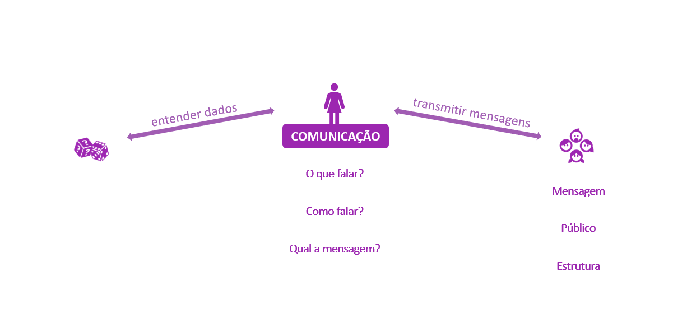

layout: true
  
<div class="my-footer"><span>

<a href="https://twitter.com/RLadiesSaoPaulo">Twitter</a> | 
<a href="http://instagram.com/RLadiesSaoPaulo">Instagram</a> |
<a href="http://facebook.com/RLadiesSaoPaulo">Facebook</a> |
<a href="https://www.meetup.com/pt-BR/R-Ladies-Sao-Paulo">Meetup</a> |
<a href="https://github.com/rladies/meetup-presentations_sao-paulo">Github</a> |
<a href="http://bit.ly/xxxx">bit.ly/xxx</a> 


</span></div> 

```{r setup, include=FALSE}
knitr::opts_chunk$set(echo = FALSE, fig.align = "center", message=FALSE, warning=FALSE)
```

```{r libs}
#graphs
 if(!require("ggplot2")){install.packages("ggplot2", dependencies = T); library(ggplot2)}
 if(!require("gganimate")){install.packages("gganimate", dependencies = T); library(gganimate)}
 if(!require("gapminder")){install.packages("gapminder", dependencies = T); library(gapminder)}

#create interactive line chart
 if(!require("highcharter")){install.packages("highcharter", dependencies = T); library(highcharter)}

#data transformation
 if(!require("dplyr")){install.packages("dplyr", dependencies = T); library(dplyr)}
 if(!require("tidyr")){install.packages("tidyr", dependencies = T); library(tidyr)}

```


<!-- programação -->
---
class: middle 

# Programação 

- Quem são as R-Ladies?

- E por que o R?

- Conceitos de Comunicação

- Aplicação práticas


<!-- programação -->
---
class: middle

# Programação

- Quem são as R-Ladies?

- E por que o R?

- Conceitos de Comunicação

- Aplicação práticas ... muitas


<!-- R-Ladies -->
---
class:  center

```{r, out.width="18%", fig.cap="<center><b> </center></b>"}
knitr::include_graphics("img/hexlogorladies.jpeg")
```


- R-Ladies é uma organização mundial que **promove a diversidade de gênero** na comunidade R.

--

- R-Ladies São Paulo integra, orgulhosamente, a organização R-Ladies Global, em São Paulo. 

--

- [Código de conduta - R-Ladies](https://github.com/rladies/starter-kit/wiki/Code-of-Conduct#portuguese)

--

- Saiba mais:
  - Website RLadies Global: [https://rladies.org/](https://rladies.org/)
  - MeetUp: [https://www.meetup.com/pt-BR/R-Ladies-Sao-Paulo](https://www.meetup.com/pt-BR/R-Ladies-Sao-Paulo)
  - Twitter: [@RLadiesGlobal](https://twitter.com/rladiesglobal), [@RLadiesSaoPaulo](https://twitter.com/RLadiesSaoPaulo)
  - Instagram: [@RLadiesSaoPaulo](http://instagram.com/RLadiesSaoPaulo)
  - Facebook: [@RLadiesSaoPaulo](http://facebook.com/RLadiesSaoPaulo)
  - Github: [https://github.com/rladies/meetup-presentations_sao-paulo](https://github.com/rladies/meetup-presentations_sao-paulo)


<!-- R -->
---
class: center


```{r, out.width="25%", fig.cap="<center><b> </center></b>"}
knitr::include_graphics("img/R_logo.svg.png")
```


- O R é uma linguagem de programação, além de um ambiente de software gratuito. 

--

- oferece um vasto leque de funcionalidades, como bases de dados e integrações com outras linguagens de programação, tudo acessível via bibliotecas.

--

- o R possui uma comunidade extremamente ativa, engajada no aprimoramento da ferramenta, desenvolvimento de novas bibliotecas, e suporte gratuito aos usuários, por meio de fóruns, encontros e materiais.

--

- Saiba mais em: [r-project.org](https://www.r-project.org/about.html) 


<!-- ciclo de ciência de dados sem R -->
---
class: middle

# O Ciclo da Ciência de Dados

```{r, out.width="70%", fig.cap="<center><b>Ilustração por Allison Horst - Twitter: <a href='https://twitter.com/allison_horst/'> @allison_horst</a> - Adaptado de WICKHAM & GROLEMUND, 2017</b></center>"}
knitr::include_graphics("img/allisonhorst/data-analysis_withoutR.png")
```


<!-- ciclo de ciência de dados com R -->
---
class: middle

# O Ciclo da Ciência de Dados

```{r, out.width="70%", fig.cap="<center><b>Ilustração por Allison Horst - Twitter: <a href='https://twitter.com/allison_horst/'> @allison_horst</a> - Adaptado de WICKHAM & GROLEMUND, 2017</b></center>"}
knitr::include_graphics("img/allisonhorst/data-analysis_withR.png")
```


<!-- communication 1 -->
---
class: middle

# Visualização de Dados

```{r, out.width="90%", fig.cap="<center><b> </center></b>"}
knitr::include_graphics("img/communication/communication_1.png")
```


<!-- comunicação 2 -->
---
class: middle

# Visualização de Dados

```{r, out.width="90%", fig.cap="<center><b> </center></b>"}
knitr::include_graphics("img/communication/communication_2.png")
```


<!-- comunicação 3 -->
---
class: middle

# Visualização de Dados

```{r, out.width="90%", fig.cap="<center><b> </center></b>"}
knitr::include_graphics("img/communication/communication_3.png")
```


<!-- comunicação 4 -->
---
class: middle

# Visualização de Dados

```{r, out.width="90%", fig.cap="<center><b> </center></b>"}

```


<!-- comunicação 5 -->
---
class: middle

# Visualização de Dados

```{r, out.width="90%", fig.cap="<center><b> </center></b>"}
knitr::include_graphics("img/communication/communication_5.png")
```


<!-- comunicação 6 -->
---
class: middle

# Visualização de Dados

```{r, out.width="90%", fig.cap="<center><b> </center></b>"}
knitr::include_graphics("img/communication/communication_6.png")
```


<!-- comunicação 7 -->
---
class: middle

# Visualização de Dados

```{r, out.width="70%", fig.cap="<center><b>Fonte: <a href='https://www.data-to-viz.com/'>From Data to Viz</a> </b></center>"}
knitr::include_graphics("img/communication/communication_7.png")
```


<!-- comunicação 8 -->
---
class: middle

# Visualização de Dados

```{r, out.width="90%", fig.cap="<center><b> </center></b>"}
knitr::include_graphics("img/communication/communication_8.png")
```


<!-- comunicação 9 -->
---
class: middle

# Visualização de Dados

```{r, out.width="70%", fig.cap="<center><b> </center></b>"}

```


<!-- comunicação 10 -->
---
class: middle

# Visualização de Dados

```{r, out.width="90%", fig.cap="<center><b> </center></b>"}
knitr::include_graphics("img/communication/communication_10.png")
```


<!-- comunicação 11 -->
---
class: middle

# Visualização de Dados

```{r, out.width="90%", fig.cap="<center><b> </center></b>"}
knitr::include_graphics("img/communication/communication_11.png")
```


<!-- introdução ggplot -->

---
class: middle

# Visualização de Dados + R = ggplot2

```{r, out.width="50%", fig.cap="<center><b>Ilustração por Allison Horst - Twitter: <a href='https://twitter.com/allison_horst/'> @allison_horst</a> </b></center>"}
knitr::include_graphics("img/allisonhorst/ggplot2_obra_prima_pt.png")
```


<!-- package ggplot -->
---
class: center

```{r, out.width="20%", fig.cap="<center><b> </center></b>"}
knitr::include_graphics("img/rlogos/hex-ggplot2.png")
```

- Mantido pela [RStudio](https://rstudio.com/)

--

- Desenvolvida pelo [Hadley Wickham](http://hadley.nz/) durante a sua tese de doutorado, na Universidade de Iowa

--

- Baseado no livro The Grammar of Graphics do Leland Wilkinson (daí o `gg` do `ggplot`].

--

- trabalha com o mapeamento dos dados a partir de objetos geométricos e atributos estéticos, ambos trabalhados em uma lógica de camadas, similarmente ao encadeamento do Pipe (`%>%`) - porém utilizando o operador +.


<!-- inicio exemplos -->

<!-- exemplo de layout -->

---
class: middle

# Exemplos

.left-code[
```{r plot-exemplo-ggplot2, echo=TRUE, fig.show="hide", out.width="90%"}
  library(ggplot2)
  ggplot(mtcars) + 
    aes(x = hp, y = mpg, colour = cyl) +
    geom_point(size = 2L)
  
```
]

.right-plot[
`)
]


<!-- rascunho Geo -->
---
class: middle

# Rascunho Geovana


---
class: middle
# Histograma

.left-code[
```{r plot-exemplo-hist1, echo=TRUE, fig.show="hide", out.width="90%"}
library(ggplot2)
library(MASS)

df <- Cars93 #criando um dataframe

ggplot(df, aes(x = Horsepower)) 
```
]

.right-plot[
`)
]


---
class: middle
# Histograma

.left-code[
```{r plot-exemplo-hist2, echo=TRUE, fig.show="hide", out.width="90%"}
ggplot(df, aes(x = Horsepower)) +
  geom_histogram()
```
]

.right-plot[
`)
]


---
class: middle
# Histograma

.left-code[
```{r plot-exemplo-hist3, echo=TRUE, fig.show="hide", out.width="90%"}
ggplot(df, aes(x = Horsepower)) +
  geom_histogram(binwidth  = 5,
                 color = "black",
                 fill = "darkorchid4")
```
]

.right-plot[
`)
]


---
class: middle
# Histograma

.left-code[
```{r plot-exemplo-hist4, echo=TRUE, fig.show="hide", out.width="90%"}
ggplot(df, aes(x = Horsepower)) +
  geom_histogram(binwidth  = 5,
                 color = "black",
                 fill = "darkorchid4") +
  theme_bw() +
  labs(x = "Frequencia", 
       y = "Horsepower", 
       title = "Potencia")
```
]

.right-plot[
`)
]


---
class: middle
# Histograma

.left-code[
```{r plot-exemplo-hist5, echo=TRUE, fig.show="hide", out.width="90%"}
ggplot(df, aes(x = Horsepower)) +
  geom_histogram(bins = 10, 
                 color = "black", 
                 fill = "darkorchid4") +
  theme_bw() +
  labs(x = "Frequencia", 
       y = "Horsepower", 
       title = "Potencia")
```
]

.right-plot[
`)
]


---
class: middle
# Gráfico de Barras

.left-code[
```{r plot-exemplo-bar1, echo=TRUE, fig.show="hide", out.width="90%"}
b <- ggplot(df, aes(x = Type))
b
```
]

.right-plot[
`)
]


---
class: middle
# Gráfico de Barras

.left-code[
```{r plot-exemplo-bar2, echo=TRUE, fig.show="hide", out.width="90%"}
b + geom_bar()
```
]

.right-plot[
`)
]


---
class: middle
# Gráfico de Barras

.left-code[
```{r plot-exemplo-bar3, echo=TRUE, fig.show="hide", out.width="90%"}
b + geom_bar(fill = "darkorchid4")
```
]

.right-plot[
`)
]


---
class: middle
# Gráfico de Barras

.left-code[
```{r plot-exemplo-bar5, echo=TRUE, fig.show="hide", out.width="90%"}
b + geom_bar(fill = "darkorchid4") +
  labs(x = "Tipo de carro", y = "Contagem",
       title = "Tipo de carro") +
  theme_minimal()
```
]

.right-plot[
`)
]


---
class: middle
# Gráfico de Barras

.left-code[
```{r plot-exemplo-bar6, echo=TRUE, fig.show="hide", out.width="90%"}
b + geom_bar(fill = "darkorchid4") +
  labs(x = "Tipo de carro", y = "Contagem",
       title = "Tipo de carro") +
  theme_minimal() +
  facet_grid( ~ AirBags)
```
]

.right-plot[
`)
]


---
class: middle
# Gráfico de Barras

.left-code[
```{r plot-exemplo-bar7, echo=TRUE, fig.show="hide", out.width="90%"}
bar <- ggplot(df, aes(Type, fill = AirBags))

bar + geom_bar(position = "dodge", 
               color = "black") +
  scale_fill_brewer(palette = "Purples", 
                    direction = 1) +
  theme_minimal()
```
]

.right-plot[
`)
]


---
class: middle
# Gráfico de Barras

.left-code[
```{r plot-exemplo-bar8, echo=TRUE, fig.show="hide", out.width="90%"}
bar + geom_bar(position = "fill", 
               color = "black") +
  scale_fill_brewer(palette = "Purples", 
                    direction = 1) +
  theme_minimal()
```
]

.right-plot[
`)
]


---
class: middle
# Gráfico de Barras

.left-code[
```{r plot-exemplo-bar9, echo=TRUE, fig.show="hide", out.width="90%"}
bar + geom_bar(position = "stack", 
               color = "black") +
  scale_fill_brewer(palette = "Purples", 
                    direction = 1) +
  theme_minimal()
```
]

.right-plot[
`)
]


---
class: middle
# Gráfico de Barras

.left-code[
```{r plot-exemplo-bar10, echo=TRUE, fig.show="hide", out.width="90%"}
bar + geom_bar(position = "stack", 
               color = "black") +
  scale_fill_brewer(palette = "Purples", 
                    direction = 1) +
  theme_minimal() +
  coord_flip()
```
]

.right-plot[
`)
]


---
class: middle
# Boxplot

.left-code[
```{r plot-exemplo-bpt1, echo=TRUE, fig.show="hide", out.width="90%"}
dfhair <- data.frame(HairEyeColor)

ggplot(dfhair, aes(x = as.factor(Sex), y = Freq, 
                   fill = Sex)) +
  theme_minimal() +
  geom_boxplot()

```
]

.right-plot[
`)
]


---
class: middle
# Boxplot

.left-code[
```{r plot-exemplo-bpt2, echo=TRUE, fig.show="hide", out.width="90%"}
ggplot(dfhair, aes(x = as.factor(Sex), y = Freq, 
                   color = Sex)) +
  theme_minimal() +
  geom_boxplot() +
  scale_x_discrete(labels = c("Homem", "Mulher")) +
  xlab("Sexo") +
  ylab("Frequencia") +
  scale_color_manual(values = 
                       c("darkorchid4", "brown2"))

```
]

.right-plot[
`)
]


---
class: middle
# Boxplot

.left-code[
```{r plot-exemplo-bpt3, echo=TRUE, fig.show="hide", out.width="90%"}
ggplot(dfhair, aes(x = as.factor(Sex), y = Freq, 
                   color = Sex)) +
  theme_minimal() +
  geom_boxplot(
    outlier.colour = "black",
    outlier.shape = 8,
    outlier.size = 4
  ) +
  scale_x_discrete(labels = c("Homem", "Mulher")) +
  xlab("Sexo") +
  ylab("Frequencia") +
  scale_color_manual(values = 
                       c("darkorchid4", "brown2"))

```
]

.right-plot[
`)
]


---
class: middle
# Boxplot

.left-code[
```{r plot-exemplo-bpt4, echo=TRUE, fig.show="hide", out.width="90%"}
ggplot(dfhair, aes(x = as.factor(Sex), y = Freq, 
                   color = Sex)) +
  theme_minimal() +
  geom_boxplot() +
  geom_dotplot(
    binaxis = 'y',
    stackdir = 'center',
    dotsize = 1,
    binwidth = 2
  ) +
  scale_x_discrete(labels = c("Homem", "Mulher")) +
  xlab("Sexo") +
  ylab("Frequencia") +
  scale_color_manual(values = 
                       c("darkorchid4", "brown2"))

```
]

.right-plot[
`)
]


---
class: middle
# Boxplot

.left-code[
```{r plot-exemplo-bpt6, echo=TRUE, fig.show="hide", out.width="90%"}
ggplot(dfhair, aes(x = as.factor(Sex), y = Freq, 
                   color = Sex)) +
  theme_minimal() +
  geom_boxplot(
    outlier.colour = "black",
    outlier.shape = 8,
    outlier.size = 4
  ) +
  scale_x_discrete(labels = c("Homem", "Mulher")) +
  labs(
    title = "Boxplot",
    x = "Sexo",
    y = "Frequência",
    subtitle = "HairEyeColor"
  )
```
]

.right-plot[
`)
]


---

class: middle
# Boxplot

.left-code[
```{r plot-exemplo-bpt7, echo=TRUE, fig.show="hide", out.width="90%"}
ggplot(dfhair, aes(x = as.factor(Sex), y = Freq, 
                   fill = Sex)) +
  theme_minimal() +
  geom_boxplot(
    outlier.colour = "black",
    outlier.shape = 8,
    outlier.size = 4
  ) +
  scale_x_discrete(labels = c("Homem", "Mulher")) +
  labs(
    title = "Boxplot",
    x = "Sexo",
    y = "Frequência",
    subtitle = "HairEyeColor"
  ) +
  scale_fill_manual(values = 
                      c("darkorchid4", "brown2"))
```
]

.right-plot[
`)
]


<!-- Outras possibilidades gráficas -->
---
class: middle

# **Quais outras opções de pacotes para visualização de dados?**


<!-- ggplot -->
---
class: middle

# ggplot2 

```{r}
library(ggplot2)
library(gganimate)
library(gapminder)
theme_set(theme_bw())
```


```{r message=FALSE, warning=FALSE, out.width="40%", cache = TRUE, fig.cap="<center><b>Fonte: <a href='https://www.datanovia.com/en/blog/gganimate-how-to-create-plots-with-beautiful-animation-in-r/'>Adaptado de Data Novia</a></b></center>"}
p <- ggplot(
  gapminder, 
  aes(x = gdpPercap, y=lifeExp, size = pop, colour = country)
  ) +
  geom_point(show.legend = FALSE, alpha = 0.7) +
  scale_color_viridis_d() +
  scale_size(range = c(2, 12)) +
  scale_x_log10() +
  labs(x = "PIB per capita", y = "Expectativa de vida (anos)")
p
```


<!-- gganimate -->
---
class: middle

# ggplot2 + gganimate
```{r, cache = TRUE, fig.cap="<center><b>Fonte: <a href='https://www.datanovia.com/en/blog/gganimate-how-to-create-plots-with-beautiful-animation-in-r/'>Adaptado de Data Novia</a></b></center>", out.width="40%"}
p + transition_time(year) +
  labs(title = "Ano: {frame_time}")
```


<!-- Highcharter -->
---
class: middle

# Highcharter

```{r, cache = T, fig.cap="<center><b> Fonte: <a href='https://rkabacoff.github.io/datavis/Interactive.html'>Adaptado de Datavis with R </a></b></center>", out.width="15%"}
# 
# # create interactive line chart
# library(highcharter)
# 
# # prepare data
# data(gapminder, package = "gapminder")
# 
# library(dplyr)
# asia <- gapminder %>%
#   filter(continent == "Americas") %>%
#   select(year, country, lifeExp)
# 
# # convert to long to wide format
# library(tidyr)
# plotdata <- spread(asia, country, lifeExp)
# 
# # generate graph
# h <- highchart() %>% 
#   hc_xAxis(categories = plotdata$year) %>% 
#   hc_add_series(name = "Brasil", 
#                 data = plotdata$Brazil) %>% 
#   hc_add_series(name = "Argentina", 
#                 data = plotdata$Argentina) %>%
#   hc_add_series(name = "Paraguai", 
#                 data = plotdata$Paraguay) %>%
#   hc_add_series(name = "Uruguai", 
#                 data = plotdata$Uruguay) %>%
#   
#   hc_title(text = "Expectativa de vida por País - Mercosul",
#            margin = 20, 
#            align = "left",
#            style = list(color = "steelblue")) %>% 
#   hc_subtitle(text = "1952 à 2007",
#               align = "left",
#               style = list(color = "#2b908f", 
#                            fontWeight = "bold")) %>% 
#   hc_credits(enabled = TRUE, # add credits
#              text = "Gapminder Data",
#              href = "http://gapminder.com") %>% 
#   hc_legend(align = "left", 
#             verticalAlign = "top",
#             layout = "vertical", 
#             x = 0, 
#             y = 100) %>%
#   hc_tooltip(crosshairs = TRUE, 
#              backgroundColor = "#FCFFC5",
#              shared = TRUE, 
#              borderWidth = 4) %>% 
#   hc_exporting(enabled = TRUE)
# 
# h
```


<!-- shiny -->
---
class: middle

#Shiny

```{r, out.width="80%", fig.cap="<center><b>GIF: Demonstração de um  <a href='https://apps.garrickadenbuie.com/user-2019/'>Shiny com Tweets sobre a useR!2019 Conf. </a> </b></center>"}

knitr::include_graphics("img/user2019shiny.gif")
```


<!-- leaflet -->
---
class: middle

# Leaflet + Shiny

```{r, out.width="80%", fig.cap="<center><b>GIF: Demonstração do  <a href='http://shiny.rstudio.com/gallery/superzip-example.html'>Shiny Super Zip Explorer</a> </b></center>"}

knitr::include_graphics("img/shinyleaflet.gif")
```

- Código disponível no [Github - RStudio](https://github.com/rstudio/shiny-examples/tree/master/063-superzip-example)


---
class: middle

# Shall we?

```{r, out.width="40%", fig.cap="<center><b>Ilustração por Allison Horst - Twitter: <a href='https://twitter.com/allison_horst/'> @allison_horst</a> </b></center>"}
knitr::include_graphics("img/allisonhorst/community1.jpg")
```


---
class:  center, middle

## Obrigada!

- Contato:

  - Website RLadies Global: [https://rladies.org/](https://rladies.org/)
  
  - MeetUp: [https://www.meetup.com/pt-BR/R-Ladies-Sao-Paulo](https://www.meetup.com/pt-BR/R-Ladies-Sao-Paulo)

  - Twitter: [@RLadiesGlobal](https://twitter.com/rladiesglobal), [@RLadiesSaoPaulo](https://twitter.com/RLadiesSaoPaulo)

  - Instagram: [@RLadiesSaoPaulo](http://instagram.com/RLadiesSaoPaulo)

  - Facebook: [@RLadiesSaoPaulo](http://facebook.com/RLadiesSaoPaulo)

  - Github: [https://github.com/rladies/meetup-presentations_sao-paulo](https://github.com/rladies/meetup-presentations_sao-paulo)

  - R-Ladies LATAM Blog (Latin America) - Em breve!


- Código da apresentação disponível [neste repositório](https://github.com/beatrizmilz/aMostra-IME-2019-DataVis).


